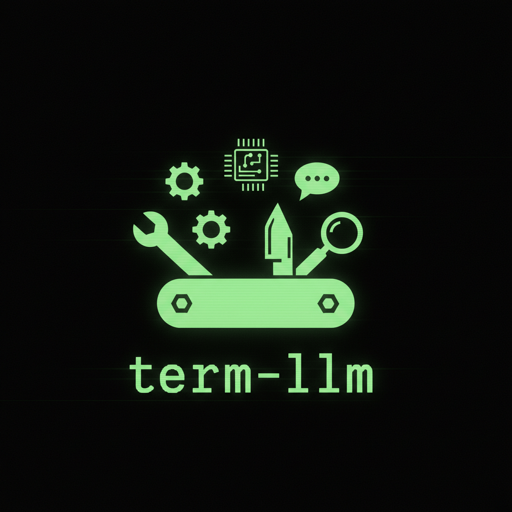

<p align="center">
  
</p>

# term-llm

Terminal-first AI runtime for commands, chat, editing, tools, jobs, agents, and local workflows.

[](https://github.com/samsaffron/term-llm/releases)

Docs hub: **https://term-llm.com**

## Why it exists

- turn natural language into executable shell commands
- run persistent chat with tools and MCP servers
- edit files with model assistance
- support agents, skills, sessions, jobs, and local automation
- work with hosted or local models

```bash
$ term-llm exec "find all go files modified today"

> find . -name "*.go" -mtime 0   Uses find with name pattern
  fd -e go --changed-within 1d   Uses fd (faster alternative)
  find . -name "*.go" -newermt "today"   Alternative find syntax
  something else...
```

## Install

```bash
curl -fsSL https://raw.githubusercontent.com/samsaffron/term-llm/main/install.sh | sh
```

Or:

```bash
go install github.com/samsaffron/term-llm@latest
```

## 30-second quickstart

No API key needed if you use Zen:

```bash
term-llm exec --provider zen "list files"
term-llm ask --provider zen "explain git rebase"
term-llm chat
```

If you already have a provider key:

```bash
export ANTHROPIC_API_KEY=your-key
# or OPENAI_API_KEY / GEMINI_API_KEY / OPENROUTER_API_KEY / XAI_API_KEY
```

## Read the docs

The detailed docs live at **https://term-llm.com** and are authored in Markdown in this repo, then built with Hugo.

- [Getting started](https://term-llm.com/getting-started/)
- [Guides](https://term-llm.com/guides/)
- [Architecture](https://term-llm.com/architecture/)
- [Reference](https://term-llm.com/reference/)

Common entry points:

- [Configuration](https://term-llm.com/reference/configuration/)
- [Providers and models](https://term-llm.com/reference/providers-and-models/)
- [Web UI and API](https://term-llm.com/guides/web-ui-and-api/)
- [Search](https://term-llm.com/guides/search/)
- [Usage](https://term-llm.com/guides/usage/)
- [Agents](https://term-llm.com/guides/agents/)
- [Skills](https://term-llm.com/guides/skills/)
- [MCP servers](https://term-llm.com/guides/mcp-servers/)
- [Memory](https://term-llm.com/guides/memory/)
- [Jobs](https://term-llm.com/guides/job-runner/)
- [Text embeddings](https://term-llm.com/guides/text-embeddings/)
- [Audio generation](https://term-llm.com/guides/audio-generation/)
- [Music generation](https://term-llm.com/guides/music-generation/)
- [Usage tracking](https://term-llm.com/reference/usage-tracking/)
- [Transcription](https://term-llm.com/guides/transcription/)
- [Notifications](https://term-llm.com/guides/notifications/)

## Proxied Widgets

Widgets are local web apps that are mounted inside the chat UI and proxied by term-llm. They are opt-in and disabled by default.

### Enabling widgets

```bash
term-llm serve web --enable-widgets
```

Widgets are discovered from `~/.config/term-llm/widgets/` (override with `--widgets-dir` or `serve.widgets_dir` in config.yaml). Each sub-directory with a `widget.yaml` manifest becomes a widget.

### widget.yaml

```yaml
title: "Sam's Hebrew Keyboard"
mount: hebrew                          # optional; defaults to directory name
description: "On-screen Hebrew keyboard"
command: ["uv", "run", "python", "server.py", "--socket", "$SOCKET"]
```

```yaml
title: "Dev Server Widget"
command: ["npm", "run", "dev", "--", "--port", "$PORT"]
```

**Required fields:** `title`, `command`

**`command`** must contain exactly one of:
- `$SOCKET` — term-llm creates a Unix domain socket and passes the path in argv and as env vars `TERM_LLM_WIDGET_SOCKET` / `SOCKET`
- `$PORT` — term-llm allocates a free localhost port and passes it as `TERM_LLM_WIDGET_PORT` / `PORT`

The widget process is started lazily on first request and stopped after 10 minutes of idle time.

### Environment variables set for widget processes

| Variable | Value |
|---|---|
| `TERM_LLM_WIDGET_ID` | directory basename |
| `TERM_LLM_WIDGET_MOUNT` | mount path segment |
| `TERM_LLM_WIDGET_BASE_PATH` / `BASE_PATH` | full URL prefix for the widget |
| `TERM_LLM_WIDGET_SOCKET` / `SOCKET` | socket path (socket mode) |
| `TERM_LLM_WIDGET_HOST` / `HOST` | `127.0.0.1` (port mode) |
| `TERM_LLM_WIDGET_PORT` / `PORT` | allocated port (port mode) |

### Routes (under `--base-path`, default `/ui`)

| Path | Description |
|---|---|
| `GET {base}/widgets/` | HTML index listing all widgets |
| `{base}/widgets/<mount>/` | Proxied widget (lazy-started on first hit) |
| `GET {base}/admin/widgets/status` | JSON status of all widgets |
| `POST {base}/admin/widgets/reload` | Re-scan widgets directory |
| `POST {base}/admin/widgets/<mount>/stop` | Stop a running widget process |

## License

MIT
